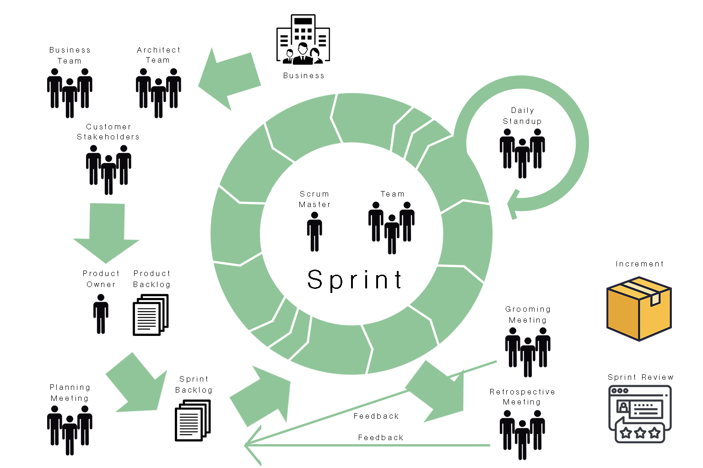
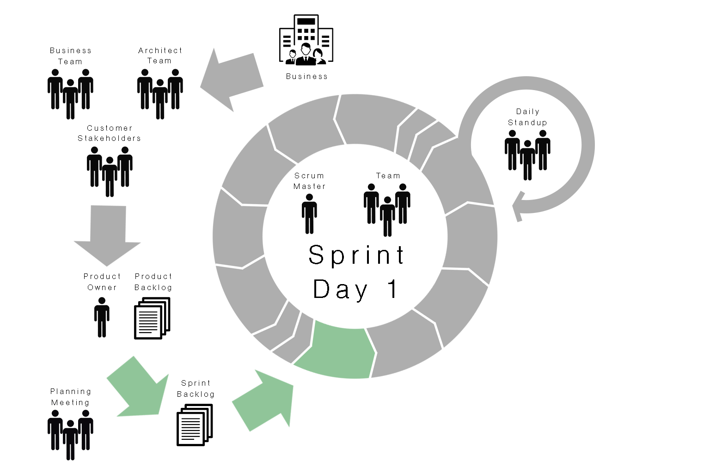
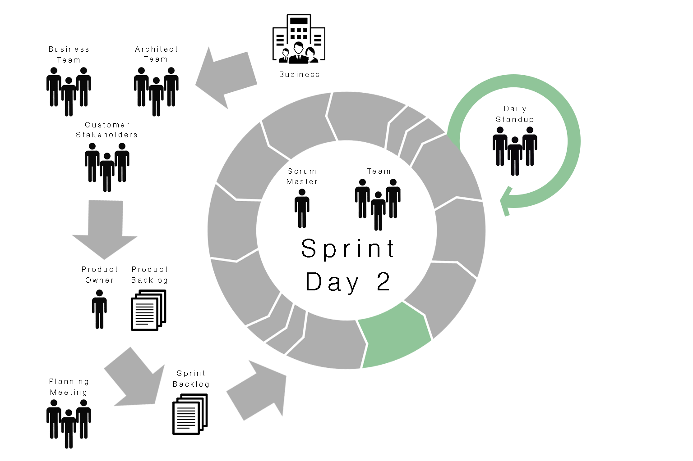
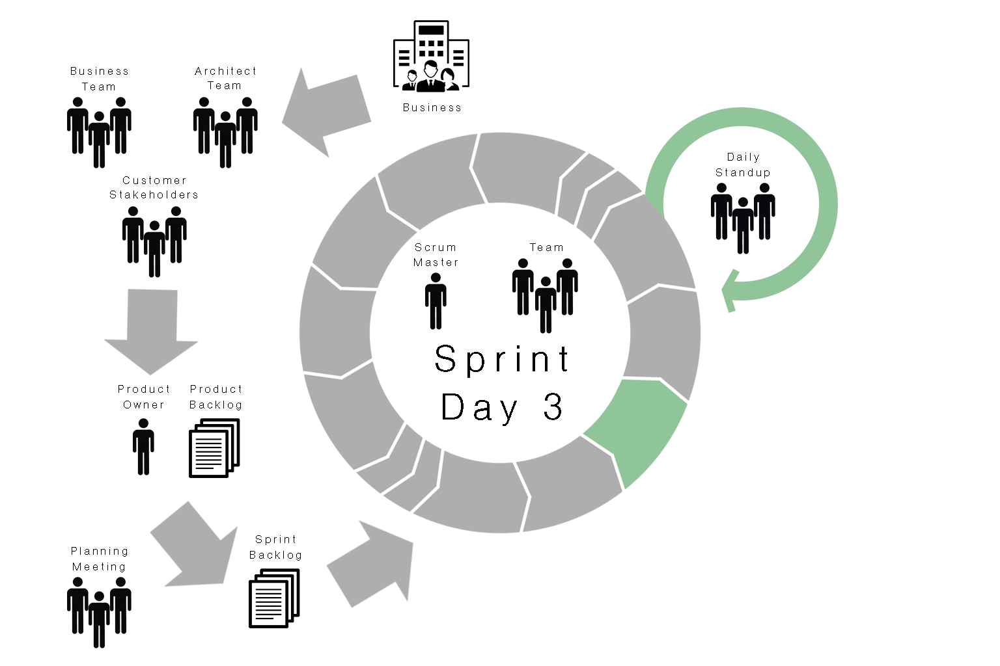
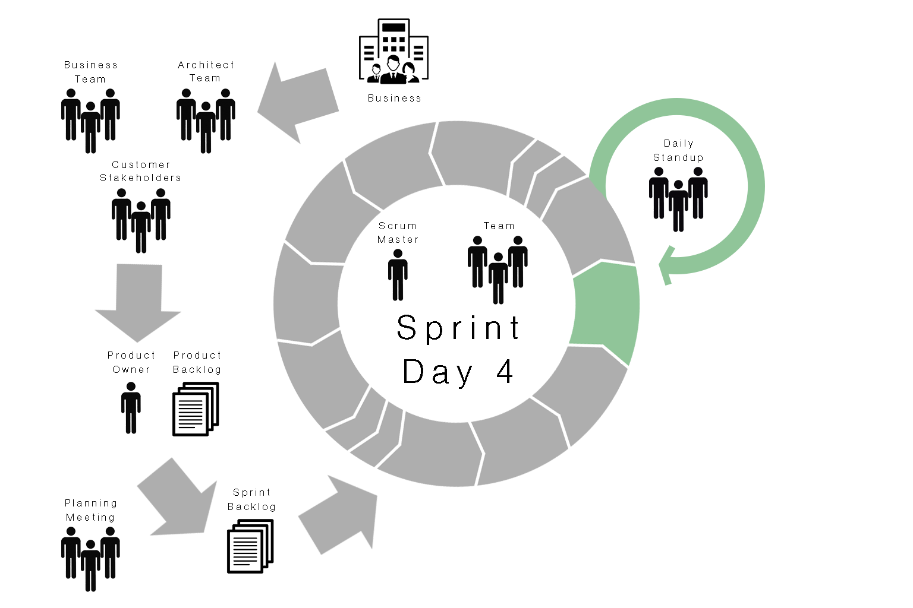
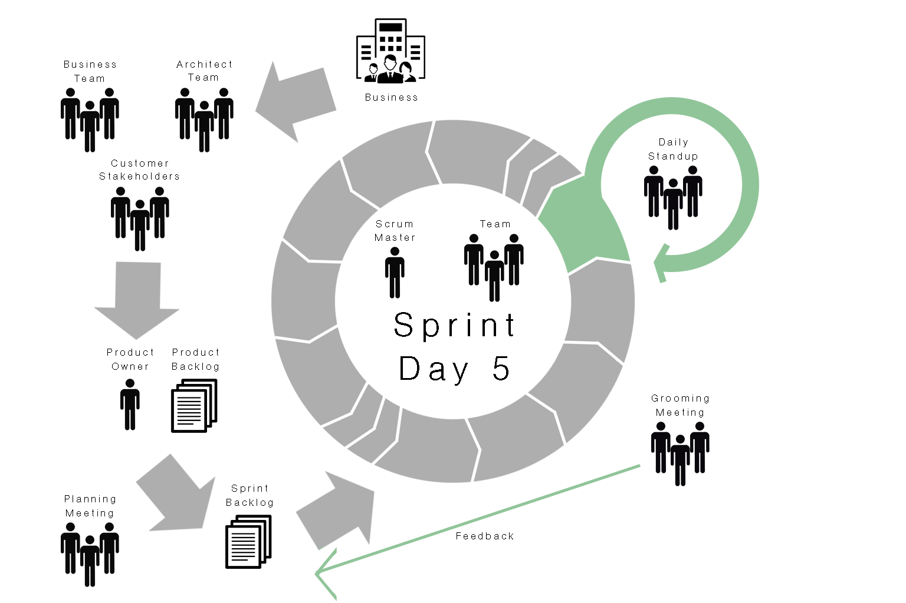
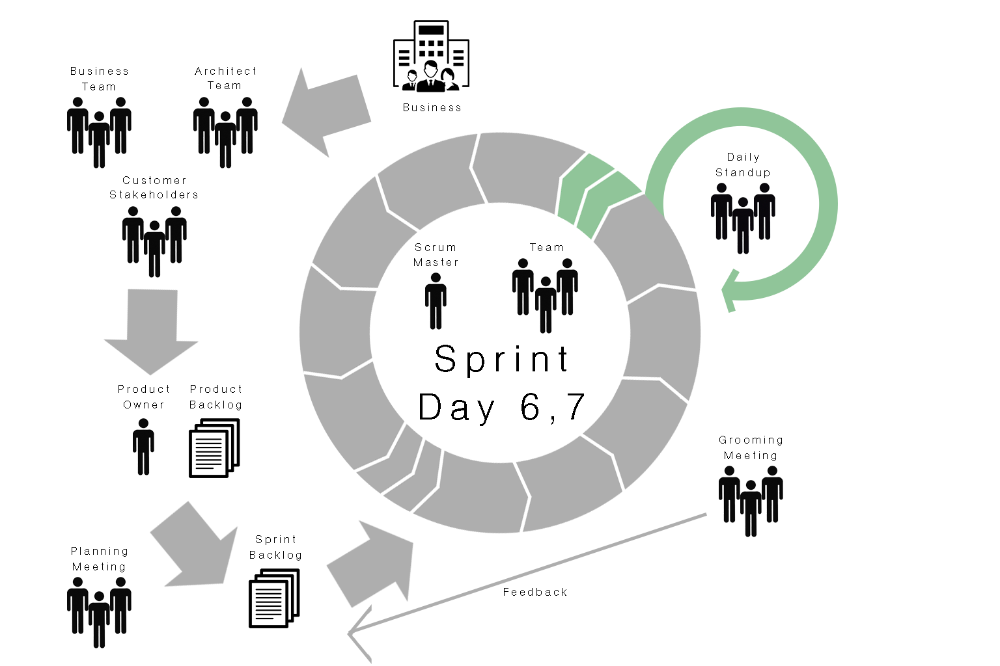
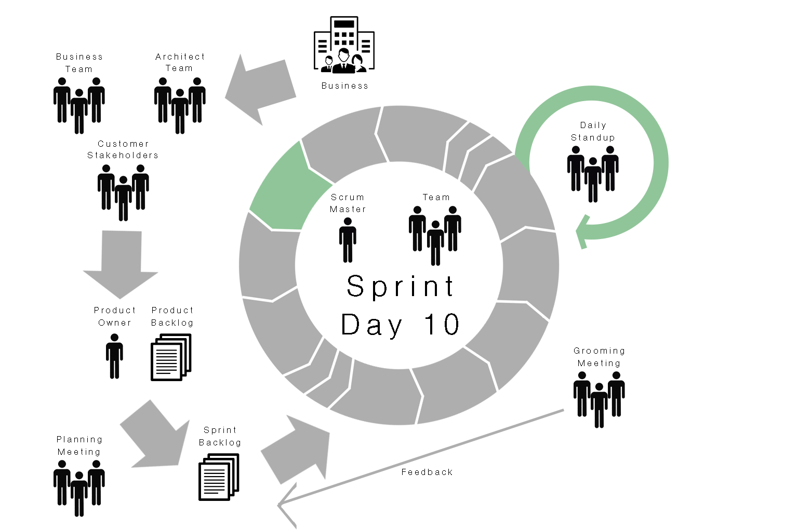
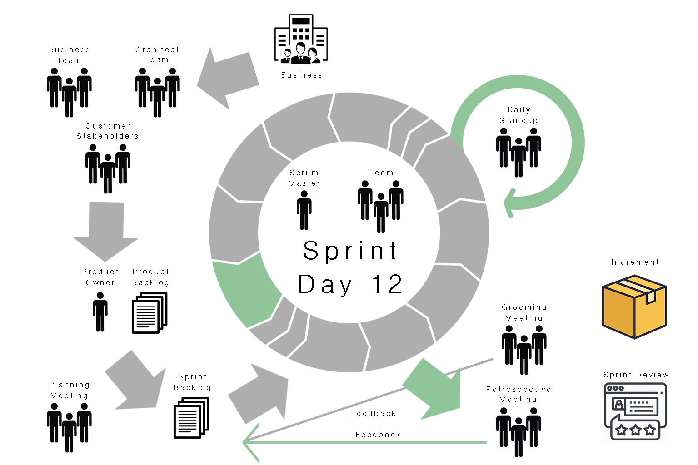
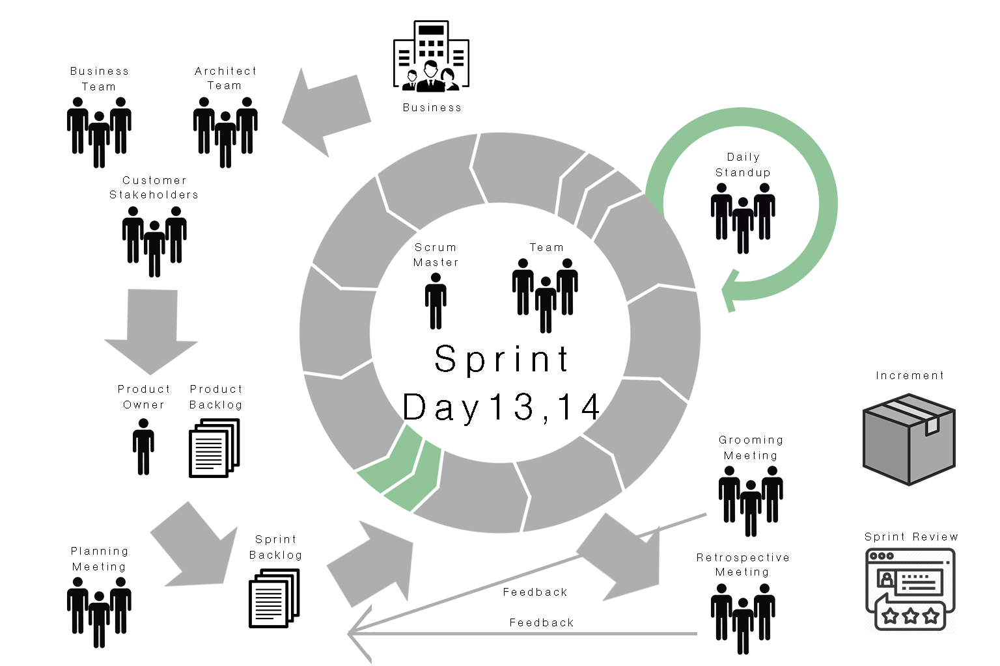

# Scrum Demo

## Team details

- The following Scrum team is composed by the following people:
  - Product Owner
  - Scrum Master
  - 2 developers
  - 1 tester
- The team defined that the duration of each sprint is 2 weeks (14 days).
- The current project is a TODO app that has no progress yet, the team will start working on this project from scratch.
- Initial Product Backlog:
  | Item              | Description                                                                                             |
  | ----------------- | ------------------------------------------------------------------------------------------------------- |
  | List TODO items   | Use the following API ([GET] /todos) and list the TODO records (fields: id, description, owner, status) |
  | Add TODO item     | Use the following API ([POST] /todos) and ask for description in a new page.                            |
  | Update TODO item  | Use the following API ([PUT] /todos/id) and display the current description in a new page.              |
  | Delete TODO item  | Use the following API ([DELETE] /todos/id) and show a confirmation popup.                               |
  | Complete item     | Use the following API ([POST] /todos/id) and show a confirmation popup.                                 |
  | Change owner      | Use the following API ([PATCH] /todos/id) and display the owner selector in a new page.                 |
  | List TODO lists   | Use the following API ([GET] /lists) and TODO records (fields: id, list name, owner).                   |
  | Add TODO list     | Use the following API ([POST] /lists) and ask for list name in a new page.                              |
  | Update TODO list  | Use the following API ([PUT] /lists) and display the current list name in a new page.                   |
  | Delete TODO list  | Use the following API ([DELETE] /lists/id) and show a confirmation popup.                               |
  | Add TODO to list  | Use the following API ([POST] /lists/todos) and display the current list id and a TODOs selector.       |

## Day 1

During sprint planning, the team reviewed the product backlog and defined the sprint backlog:

| Item              | Description                                                                                             |
| ----------------- | ------------------------------------------------------------------------------------------------------- |
| List TODO items   | Use the following API ([GET] /todos) and list the TODO records (fields: id, description, owner, status) |
| Add TODO item     | Use the following API ([POST] /todos) and ask for description in a new page.                            |
| Update TODO item  | Use the following API ([PUT] /todos/id) and display the current description in a new page.              |
| List TODO lists   | Use the following API ([GET] /lists) and TODO records (fields: id, list name, owner).                   |
| Add TODO list     | Use the following API ([POST] /lists) and ask for list name in a new page.                              |
| Update TODO list  | Use the following API ([PUT] /lists) and display the current list name in a new page.                   |

TODO tasks were assigned to developer A. TODO list tasks were assigned to developer B.

Developer A started working on List TODO items.

Developer B started working on List TODO lists.

Tester A started working on test plan for List TODO items.

## Day 2

Daily scrum:
- Developer A
  - What did I do yesterday?
    - I started working on List TODO items, I have the new view done and working with fake data.
  - What am I going to do today?
    - Today I'm going to use the API to get the data and populate the table.
  - What help do I need?
    - I'm ok, no help required.

- Developer B
  - What did I do yesterday?
    - I started working on List TODO lists, I have the new view done and working with hard coded data.
  - What am I going to do today?
    - Today I'm going to use the API to retrieve the data and use it in the table.
  - What help do I need?
    - I'm ok, no help required.

- Tester A
  - What did I do yesterday?
    - I started working on test plan for List TODO items.
  - What am I going to do today?
    - Today I'm going to start working on test plan for List TODO lists.
  - What help do I need?
    - I'm ok, no help required.

## Day 3

Daily scrum:
- Developer A
  - What did I do yesterday?
    - I used the API and filled the table.
  - What am I going to do today?
    - Today I need to work on the pagination, it seems that the API requires an extra field to filter completed TODO items.
  - What help do I need?
    - I'm ok, no help required.

- Developer B
  - What did I do yesterday?
    - I used the API and the table is working with real data now.
  - What am I going to do today?
    - Today I'm going to work on unit tests for my current task.
  - What help do I need?
    - I'm ok, no help required.

- Tester A
  - What did I do yesterday?
    - I finished the test plan for List TODO lists.
  - What am I going to do today?
    - Today I'm going to start working on test plan for Add TODO item.
  - What help do I need?
    - I'm ok, no help required.

## Day 4

Daily scrum:
- Developer A
  - What did I do yesterday?
    - I added two more views, they are three now: All, Completed, Non Completed.
  - What am I going to do today?
    - Today I will integrate the views with the right filter.
  - What help do I need?
    - I'm ok, no help required.

- Developer B
  - What did I do yesterday?
    - I added the unit tests and started working on Add TODO list.
  - What am I going to do today?
    - Today I will add the new page for adding a TODO list.
  - What help do I need?
    - I'm ok, no help required.

- Tester A
  - What did I do yesterday?
    - I finished the test plan for Add TODO item.
  - What am I going to do today?
    - Today I'm going to start working on test plan for Add TODO lists.
  - What help do I need?
    - I'm ok, no help required.

## Day 5

Daily scrum:
- Developer A
  - What did I do yesterday?
    - I integrated the new views and added unit tests.
  - What am I going to do today?
    - Today I will start working on add TODO item.
  - What help do I need?
    - I'm ok, no help required.

- Developer B
  - What did I do yesterday?
    - I added the new page for adding a TODO list and used the API. It's working fine.
  - What am I going to do today?
    - Today I will be adding unit tests.
  - What help do I need?
    - I'm ok, no help required.

- Tester A
  - What did I do yesterday?
    - I finished the test plan for Add TODO lists.
  - What am I going to do today?
    - Today I'm going to start testing List TODO items and List TODO lists.
  - What help do I need?
    - I'm ok, no help required.

Backlog Grooming:

The team reviewed the product backlog and re-prioritize some items:

| Item              | Description                                                                                             |
| ----------------- | ------------------------------------------------------------------------------------------------------- |
| Add TODO to list  | Use the following API ([POST] /lists/todos) and display the current list id and a TODOs selector.       |
| Complete item     | Use the following API ([POST] /todos/id) and show a confirmation popup.                                 |
| Delete TODO item  | Use the following API ([DELETE] /todos/id) and show a confirmation popup.                               |
| Delete TODO list  | Use the following API ([DELETE] /lists/id) and show a confirmation popup.                               |
| Change owner      | Use the following API ([PATCH] /todos/id) and display the owner selector in a new page.                 |

## Day 6, 7 - Weekend

## Day 8

Daily scrum:
- Developer A
  - What did I do yesterday?
    - I added the new view for adding a TODO item.
  - What am I going to do today?
    - Today I will use the API to add TODO items.
  - What help do I need?
    - I'm ok, no help required.

- Developer B
  - What did I do yesterday?
    - I added the unit test to Add TODO list and started working on update TODO list.
  - What am I going to do today?
    - Today I will finish the new page to update TODO list and use the API.
  - What help do I need?
    - I'm ok, no help required.

- Tester A
  - What did I do yesterday?
    - I finished the testing for List TODO items and List TODO lists.
  - What am I going to do today?
    - Today I'm going to start testing Add TODO list and start working on test plan for update TODO item.
  - What help do I need?
    - I'm ok, no help required.

## Day 9

Daily scrum:
- Developer A
  - What did I do yesterday?
    - I used the API to add TODO items, but it seems that there's a validation for unique names that needs to be handled.
  - What am I going to do today?
    - Today I will be working on the validation.
  - What help do I need?
    - I need the TODOs documentation to see all the validations. It was given by the Scrum Master.

- Developer B
  - What did I do yesterday?
    - I finished the page to update a TODO list and used the API.
  - What am I going to do today?
    - Today I will added some unit tests and I think I will need some extra work.
  - What help do I need?
    - I'm ok, no help required.

- Tester A
  - What did I do yesterday?
    - I finished testing Add TODO lists and test plan for update TODO item.
  - What am I going to do today?
    - Today I'm going to start working on test plan for update TODO list.
  - What help do I need?
    - I'm ok, no help required.

A new item was added for developer B, this is how the sprint backlog looks like:

| Item              | Description                                                                                             |
| ----------------- | ------------------------------------------------------------------------------------------------------- |
| List TODO items   | Use the following API ([GET] /todos) and list the TODO records (fields: id, description, owner, status) |
| Add TODO item     | Use the following API ([POST] /todos) and ask for description in a new page.                            |
| Update TODO item  | Use the following API ([PUT] /todos/id) and display the current description in a new page.              |
| List TODO lists   | Use the following API ([GET] /lists) and TODO records (fields: id, list name, owner).                   |
| Add TODO list     | Use the following API ([POST] /lists) and ask for list name in a new page.                              |
| Update TODO list  | Use the following API ([PUT] /lists) and display the current list name in a new page.                   |
| Add TODO to list  | Use the following API ([POST] /lists/todos) and display the current list id and a TODOs selector.       |

## Day 10

Daily scrum:
- Developer A
  - What did I do yesterday?
    - I added the validations for adding a new TODO item.
  - What am I going to do today?
    - Today I will be adding unit tests and start working on update TODO items.
  - What help do I need?
    - I'm ok, no help required.

- Developer B
  - What did I do yesterday?
    - I started working on Add TODO to list.
  - What am I going to do today?
    - Today I will be adding the new page to relate the TODO item to the TODO list.
  - What help do I need?
    - I'm ok, no help required.

- Tester A
  - What did I do yesterday?
    - I finished test plan for Update TODO list.
  - What am I going to do today?
    - Today I'm going to start testing update TODO list.
  - What help do I need?
    - I'm ok, no help required.

## Day 11

Daily scrum:
- Developer A
  - What did I do yesterday?
    - I added the update page and use the API to update it.
  - What am I going to do today?
    - Today I will be adding the validation and unit tests and I think I will need some more work.
  - What help do I need?
    - I'm ok, no help required.

- Developer B
  - What did I do yesterday?
    - I added the new page to relate the TODO item to a TODO list.
  - What am I going to do today?
    - Today I will be using the API to relate the TODO item to a TODO list.
  - What help do I need?
    - I'm ok, no help required.
  
- Tester A
  - What did I do yesterday?
    - I finished testing update TODO list.
  - What am I going to do today?
    - Today I'm going to be working on test plan for Add TODO to list.
  - What help do I need?
    - I'm ok, no help required.

A new item was added for developer B, this is how the sprint backlog looks like:

| Item              | Description                                                                                             |
| ----------------- | ------------------------------------------------------------------------------------------------------- |
| List TODO items   | Use the following API ([GET] /todos) and list the TODO records (fields: id, description, owner, status) |
| Add TODO item     | Use the following API ([POST] /todos) and ask for description in a new page.                            |
| Update TODO item  | Use the following API ([PUT] /todos/id) and display the current description in a new page.              |
| List TODO lists   | Use the following API ([GET] /lists) and TODO records (fields: id, list name, owner).                   |
| Add TODO list     | Use the following API ([POST] /lists) and ask for list name in a new page.                              |
| Update TODO list  | Use the following API ([PUT] /lists) and display the current list name in a new page.                   |
| Add TODO to list  | Use the following API ([POST] /lists/todos) and display the current list id and a TODOs selector.       |
| Complete item     | Use the following API ([POST] /todos/id) and show a confirmation popup.                                 |

## Day 12

Daily scrum:
- Developer A
  - What did I do yesterday?
    - I applied the validations and added the unit tests.
  - What am I going to do today?
    - Today I will start working on Complete item task.
  - What help do I need?
    - I'm ok, no help required.

- Developer B
  - What did I do yesterday?
    - I used the API to relate the TODO item to a TODO list, it seems to be working fine.
  - What am I going to do today?
    - Today I will be adding some unit tests.
  - What help do I need?
    - I'm ok, no help required.

- Tester A
  - What did I do yesterday?
    - I finished test plan for Add TODO to list.
  - What am I going to do today?
    - Today I'm going to be testing Update TODO item and start working on test plan for complete item.
  - What help do I need?
    - I'm ok, no help required.

Sprint Review:

The PO demonstrated the following features:
- List TODO items
- Add TODO item
- List TODO lists
- Add TODO list
- Update TODO list

He received some feedback about the following items:
- List TODO items: It would be a good idea to add a way to filter TODO items by description.
- List TODO lists: It's like the list is so loaded. It would be a good idea to remove the related TODO items and add a view page of every list.
- Add TODO list: It's a good idea to add a way to create related TODO items from this page.

Sprint Retrospective:

On this meeting the team talked about the following topics:
- Some tasks didn't include some details:
  - Different views on List TODO items
  - Validations
  - Filters
- Good communication when having doubts

The following retro goals were defined:
- Consider validations and extra details when discussing about tasks in planning and grooming meetings.
- Add mockups attached to tasks.

Increment - TODO app v1:
- List TODO items
- Add TODO item
- Update TODO item
- List TODO lists
- Add TODO list
- Update TODO list

## Day 13, 14 - Weekend

