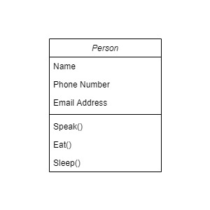
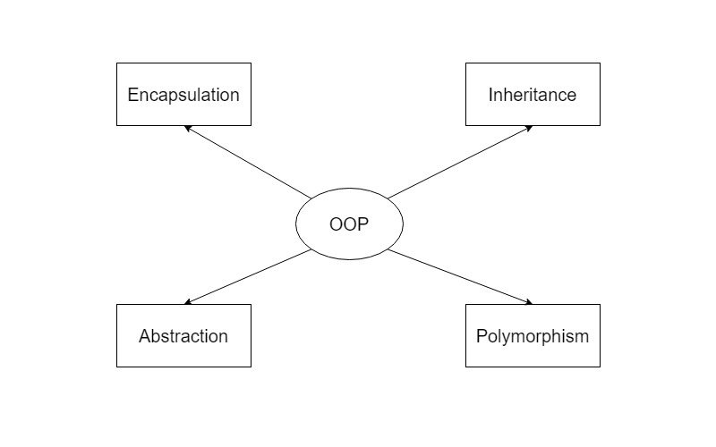
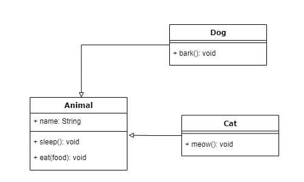

# Object Oriented Programming 

Object-Oriented programming is a paradigm that let us think like we are working with real-life entities like car or dog, we call them objects. When we talk about these entities, we can say that they have some attributes and they can do various works — methods.

We can use a person as an example. We can say that a person will have a name, phone number and email address. They are the attributes. A person can do many things like speak, eat and sleep. They are the methods.



# OOPs Concepts

When talking about Object-Oriented programming, we should mention some concepts.



## Abstraction

This concept is about understanding real-world entities and be able to model them into our software. 

For example, we can imagine a real-world problem that needs to be solve and we can think on a solution by using Object-Oriented programming. First, we need to identify all the entities involved into the problem. For each entity, we need to know all the attributes that describes it and also the actions the entity can do. Finally, having all the entities defined, we can also describe the relationship between all the entities.

With this example, what we are doing is to simplify the complexity to understand the problem. This simplification process is called Abstraction.

In the example, when mentioning there are relationships between the defined entities, we can talk about the following: Association, Aggregation, and Composition.

### Association

When talking about association, we can say that it is a relationship between two or more objects where each object is independent of each other.

The following example will show a class Person and two independent instances of this class. 

```js
class Person {
  constructor(name, surname) {
    this.name = name;
    this.surname = surname;
    this.parent = null;
  }
}

var alfredRobinson = new Person("Alfred", "Robinson");
var alanRobinson = new Person("Alan", "Robinson");

alanRobinson.parent = alfredRobinson;
```

The last line of code establishes an association between the two objects, it means Alfred Robinson is Alan Robinson's parent, but both of two objects live independently, that means any update to one of the objects is independently from the other.

### Aggregation

Aggregation is an special kind of association. In this case, an object has a major role than the other one. The object with major role is called aggregate and the object with minor role is called component.

In both of them, Aggregation and Association, every object is independent of the other one. The main difference between them is that, when talking about Association, you can delete any of the objects involved in the relationship and the other one is still alive. When talking about Aggregation, given there are two kind of object roles, the deletion of the object with major role means something different than the deletion of the objects with minor role

For example, when you have an aggregation relationship, if you delete the object with major role, the object with minor role is still alive, but if you delete the object with minor role, the object with major role stops having the same meaning. The real meaning of the object with major role is bound to the presence of the object with minor role on it.

In conclusion, Aggregation is when you have an object composed of several objects, while Association is when you have autonomous objects and you relate them somehow.

```js
class Person {
  constructor(name, surname) {
    this.name = name;
    this.surname = surname;
    this.parent = null;
  }
}

class Company {
  constructor(name, surname) {
    this.name = name;
    this.employees = [];
  }
}

var alfredRobinson = new Person("Alfred", "Robinson");
var jasonClark = new Person("Jason", "Clark");

var businessCompany = new Company("Business");

businessCompany.employees.push(alfredRobinson);
businessCompany.employees.push(jasonClark);
```

### Composition

Composition is kind of a special case of Aggregation. In this case, the objects with minor role have no life without the object with major role.

```js
class Address {
  constructor(street, city, country) {
    this.street = street;
    this.city = city;
    this.country = country;
  }
}

class Person {
  constructor(name, surname, address) {
    this.name = name;
    this.surname = surname;
    this.address = address;
  }
}

var alfredRobinson = new Person("Alfred", "Robinson", new Address("123 Duncannon Street", "London", "United Kingdom"));
```

## Encapsulation

This principle talks about hiding complexity and expose only what is needed to use the object. As an example, we can think on a cell phone. We can use a cell phone to make calls, send messages, listen to music and many other things. Is a fact that there is a big process to  accomplish a phone call, sending a message, or reproducing any song on the cell phone, but we don't need to think on that process, we only want it to happen. 

```js
class CellPhone {
  constructor(phoneNumber) {
    this.phoneNumber = phoneNumber;
  }

  makeCall(contactPhoneNumber) {
    // The logic to make the call to a contact goes here. It's hidden to the user.
  }

  sendMessage(contactPhoneNumber, textMessage) {
    // The logic to send a message to a contact goes here. It's hidden to the user.
  }

  playSong(songId) {
    // The logic to play a song goes here. It's hidden to the user.
  }
}

var myCellPhone = new CellPhone(12345678);

myCellPhone.makeCall(87654321);
myCellPhone.sendMessage(87654321, "Hey there!");
myCellPhone.playSong(99);
```

## Inheritance

This principle talks about objects using properties and methods from other objects, in other words, extending the functionality of defined objects. As an example, we can think on animals. The base object may be Animal with the following property: Name and the methods: Sleep and Eat. Knowing that, we can also think on Dogs and Cats, they are animals, but they have some unique actions. Dogs can bark and cats can meow.



```js
class Animal {
  constructor(name) {
    this.name = name;
  }

  sleep() {
    // The logic to make sleep.
  }

  eat(food) {
    // The logic to eat an specific food.
  }
}

class Dog extends Animal {
  constructor(name) {
    super(name);
  }

  bark() {
    // The logic for the dog to bark.
  }
}

class Cat extends Animal {
  constructor(name) {
    super(name);
  }

  meow() {
    // The logic for the cat to meow.
  }
}

var tobi = new Dog("Tobi");
var moon = new Cat("Moon");

tobi.sleep();
tobi.eat("dogs food");
tobi.bark();

moon.sleep();
moon.eat("dogs food");
moon.meow();
```

## Polymorphism

This principle talks about overloading specific actions of an entity. As an example, we can think on calculator. Calulator has 4 core operations, addition, subtraction, multiplication and division. Let's talk about addition. The base operation may be between two numbers, a and b, and the result should be a + b, but there can be the case when the calculator needs to do addition between 3 numbers, a, b and c. In this case, we can overload the method to do addition to also support 3 numbers as input.

```js
class Calculator {
  constructor() { }

  sum(a = 0, b = 0, c = 0) {
    return a + b + c;
  }
}

var myCalculator = new Calculator();

console.log(myCalculator.sum(10, 20)); // 30
console.log(myCalculator.sum(10, 20, 30)); // 60
```

**Note:** JavaScript language doesn't require to create multiple methods to demonstrate polymorphism as other languages. For example in C# it would be expressed like the following:

```c#
public int Sum(int x, int y) {
  return Sum(x, y, 0);
}

public int Sum(int x, int y, int z) {
  return x + y + z;
}
```

# Other Features

Talking about code, we can find some examples about different features related to OOP [here](/docs/resources/development-skills/programming-paradigms/object-oriented-examples.md).

# References
- [Mastering JavaScript Object-Oriented Programming](https://www.amazon.com/-/es/Andrea-Chiarelli/dp/1785889109) by Andrea Chiarelli.
- [Medium - OOP: Everything you need to know about Object Oriented Programming](https://medium.com/from-the-scratch/oop-everything-you-need-to-know-about-object-oriented-programming-aee3c18e281b)